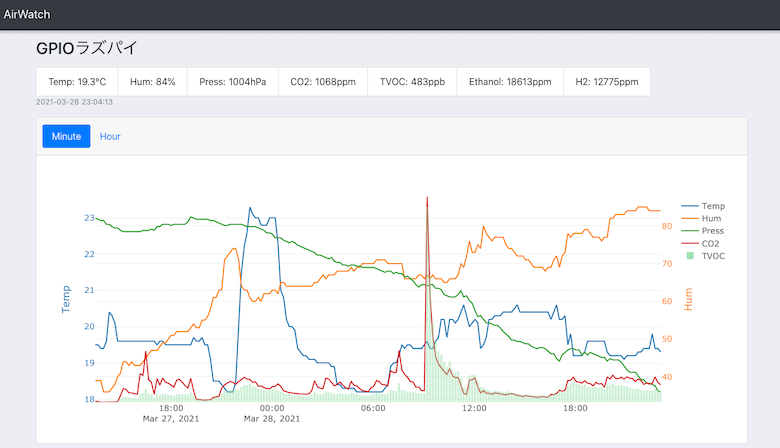
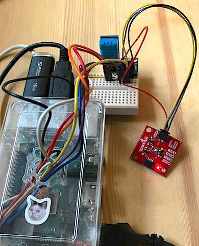
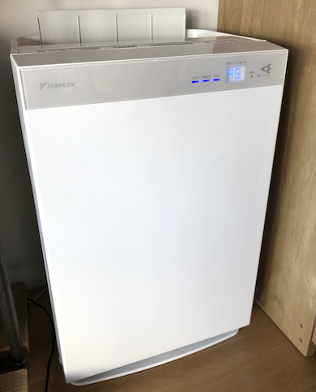
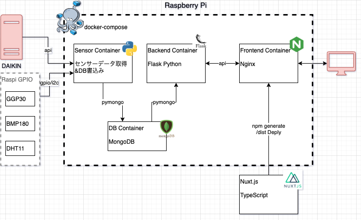

# airwatch
RaspberryPIで稼働する**空気品質モニターシステム**  
リビングと書斎&寝室の空気品質向上のためのモニタリングWebアプリ。

  






## Features
- Livingと書斎の空気品質をモニタリング
- グラフの初期描画を高速化、非同期でデータ追加
- 一定間隔でデータを再取得しグラフを更新し続ける
- 1時間毎のモニタリング内容も表示


## Requirement
- RaspberryPi:実行環境
- Docker,Docker-compose:コンテナ環境
- ダイキン空気清浄機:空気センサー付き家電
- GPIO
  接続のセンサー群


### Raspberry Pi
- device:Raspberry Pi 3 Model B
- OS: Raspbian GNU/Linux 9 (stretch)


### Docker, docker-compose
実行環境のRaspberryPiにインストール

- Docker version 19.03.14
- docker-compose version 1.25.3


### ダイキン空気清浄機
「ダイキン 加湿ストリーマ空気清浄機 MCK70W」  
温度、湿度、匂い、PM25、ホコリ

ローカルネットワークを利用したAPI通信でセンサー値取得できるIOT家電なら代用可。  


### GPIO接続のセンサー
- BMP180:温度、気圧、高度、海面気圧
- DHT11:温度、湿度
- SGP30:CO2(eco2), TVOC, エタノール, H2


#### GPIO接続
- BMP180, SGP30:i2cで並列接続
- DHT11: PIN4番使用


## Usage
1.Nuxt.jsから静的HTMLコンテンツを生成
```
cd frontend
npm i
npm run generate
```
`/dist`ディレクトリにコンテンツが生成される。

2.コンテナを立ち上げる
```
docker-compose up -d
```


## Note
- URLQuery付与で、初期描画データ数を任意に指定可能。例:`http://xxx?limit=30`
- container.env:デフォルトの分間隔、IOT家電(ダイキン)のIPアドレスを変更可能。


## Author
- akinko
- akira.seto@gmail.com
- [Qiita](https://qiita.com/akinko)


## License

[MIT license](https://en.wikipedia.org/wiki/MIT_License).
